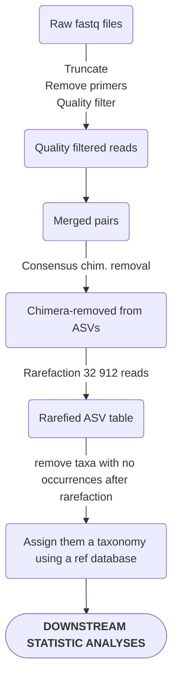

# General considerations

The substrate DNA was extracted at Université de Montréal during fall 2020, using the PowerSoil PowerLyzer extraction kits. The DNA extracts were amplified using 3 sets of primers:

|Target organism|Forward|Reverse|
:-----------|:-----:|:-----:|
AM fungi|WANDA (general eukaryotic)|[AML2](https://doi.org/10.1111/j.1574-6941.2008.00531.x)
General fungal (ITS2 region)|gITS7|ITS4
Prokaryotes 16S|515F|926R

 
These amplicons were normalized, and multiplexed in a single Illumina MiSeq PE300bp run at the CERMO facilities in UQAM. The CERMO provided us with raw fastq files that we treated using this general pipeline:

