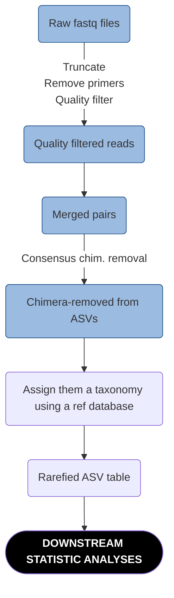

# General considerations

The substrate DNA was extracted at Université de Montréal during fall 2020, using the PowerSoil PowerLyzer extraction kits. The DNA extracts were amplified using 3 sets of primers:

|Target organism|Forward|Reverse|
:-----------|:-----:|:-----:|
AM fungi|WANDA (general eukaryotic)|[AML2](https://doi.org/10.1111/j.1574-6941.2008.00531.x)
General fungal (ITS2 region)|gITS7|ITS4
Prokaryotes 16S|515F|926R

 
These amplicons were normalized, and multiplexed in a single Illumina MiSeq PE300bp run at the CERMO facilities in UQAM. The CERMO provided us with raw fastq files that we treated using this general pipeline:

   Below we outline our bioinformatic pipeline for each microbial group.

  

# General fungi (ITS2)
These sequences were analyzed in batch in the R package ``dada2`` using [the following script](./Script_ITS.R). Briefly, this script filters sequences through:

- Primer removal
- Quality thresholding using ``tuncQ = 2``
- Sequence trimming (upon visual inspection of median quality scores ~base position): it was decided to trim fwd reads at 250bp and rev reads at 200 bp
- Not allowing any indeterminate base pair (N)

Then follows error learnin and sample inference, after which paired-reads are merged together. Chimeras are then inferred using the "consensus" method, and ta
  

# Prokaryotes (16S)

  

# AM fungal (18S)